import Sidenote from "../../../components/Sidenote.astro";

> **July 2022 Update:** At long last, FerryFriend 4.0 for iOS has officially been released! Find it on the [App Store](https://apps.apple.com/us/app/ferryfriend/id918755226).

## Introduction

[FerryFriend](https://www.ferryfriend.com/), currently in version 3.0\*, is the premier schedule app for the Washington State Ferries, with an average App Store rating of 5.0 and over 2000 reviews. However, the app, originally written in Swift, has to this point only been available for iOS. As usage grew, many Android users expressed their desire to see the app come to that platform.

<Sidenote>
  *This article was written before the launch of [FerryFriend
  4.0](https://www.ferryfriend.com/).
</Sidenote>

I had the great opportunity to join the FerryFriend team for the development of an Android version of the app, originally conceived to be a standalone version alongside the existing iOS app (more on that later). Based on my previous experience with React Native, we decided it would be the best choice of framework to build the new version. The goal throughout the project was to emulate the functionality and aesthetic of the existing app, which provided a design schematic to start from.

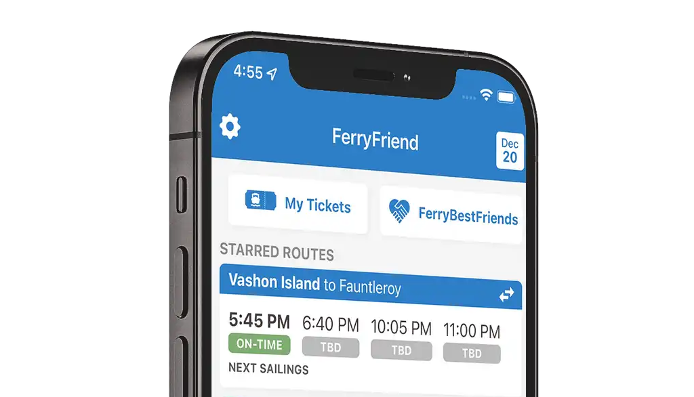

## Integrating with the WSF API

Washington State (WSDOT) provides a number of [useful APIs](https://www.wsdot.wa.gov/ferries/api/schedule/documentation/) for public access to ferry information. These form the backbone of the data used by FerryFriend to show schedules, alerts, fares, and vessel positions.

One of the challenges of the WSDOT API is that there are inconsistencies and proprietary data formats between the different routes. To handle these inconsistencies, we chose to implement a "Provider" model in order to preprocess all incoming WSF data into a common format used throughout the app. This model consists of 5 different WSF API providers which retrieve data from the APIs using Axios. The results are stored in a local cache to reduce the total number of network requests, as well as aid in offline data storage.

A "Data Manager" then consumes these providers, packaging different data sources together for use in individual components, which consume the data via a global context reference. A subscriber model is used to continually check for schedule and delay updates while the app is focused, a particularly important feature for the time-sensitive data they represent. For example, the route schedule screen below consumes data from the WSF schedule provider (scheduled sailing times), WSF Reservation details provider (reservable space availability), WSF terminal info provider (drive-up spaces), and FerryFriend predictions provider (delay predictions).

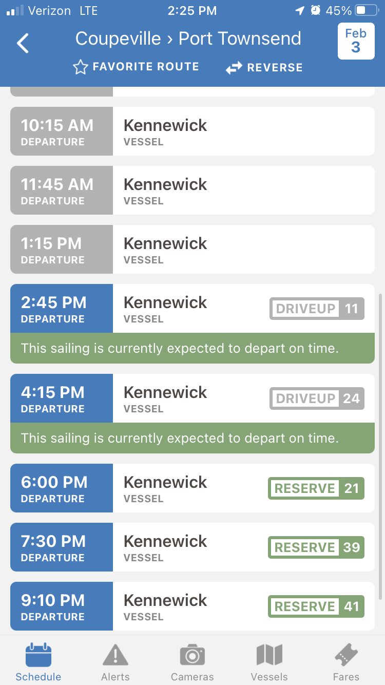
_The schedule screen shows information for a single route on a single day..._

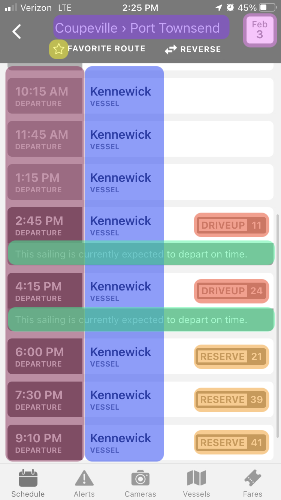
_...which consists of data derived from multiple sources._

## FerryFriend Native becomes FerryFriend 4.0

As the main functionality of the app began to come together, we gradually realized that the increase in maintainability, and ability of one codebase to support two separate native versions of the app would ultimately make the React Native version a logical choice to become the new primary codebase for FerryFriend, necessitating a new major version of the iOS app as well. With this in mind, we began to implement several completely new features alongside the existing features from FerryFriend 3.0.

### Improvements in user interface design

One of the benefits of having an existing user base was the availability of plenty of user feedback on existing designs. Some of this feedback led to redesigns of user interaction elements. First up was the tab navigation interface:

**Before:**

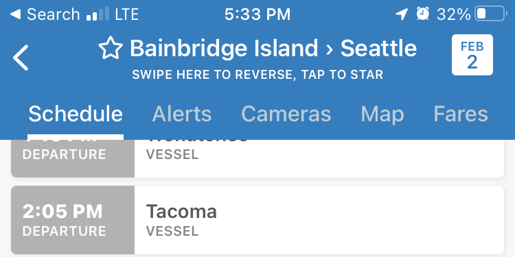
_The original menu was functional, but dense user controls could be confusing and difficult to target._

**After:**

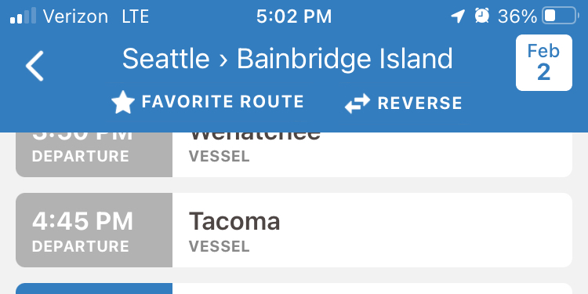
_Using space freed up by the tab navigator, we were able to redesign the route top bar to increase legibility and simplify user interaction._

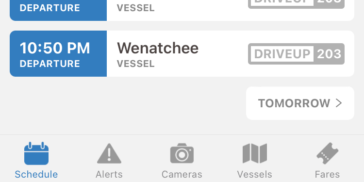
_The tab navigator was moved from the upper margin of the route screen to the bottom, improving access with one hand._

Two of the most popular features on FerryFriend are the ferry line screen and the vessel watch screen. We took care to improve the usability of these screens without drastically changing their layout.

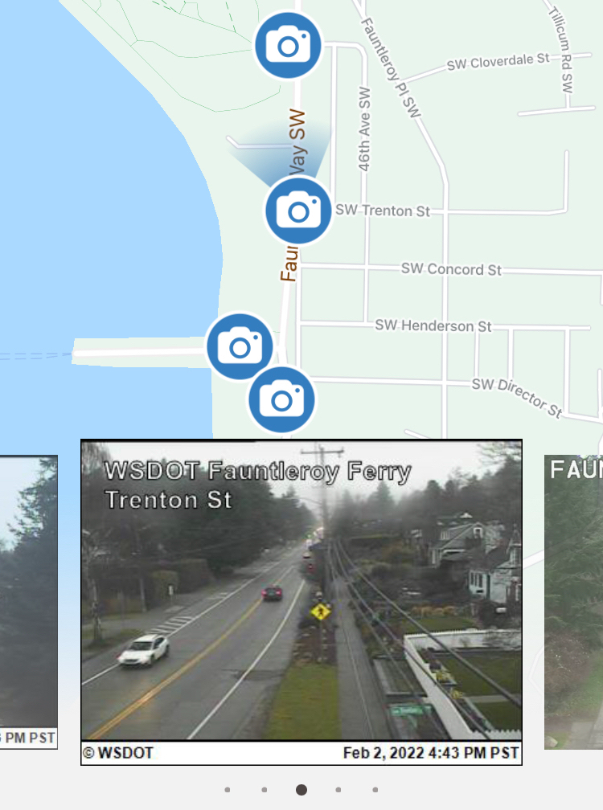
_On the cameras screen, we improved touch targets on the carousel viewer and increased the legibility of the map._

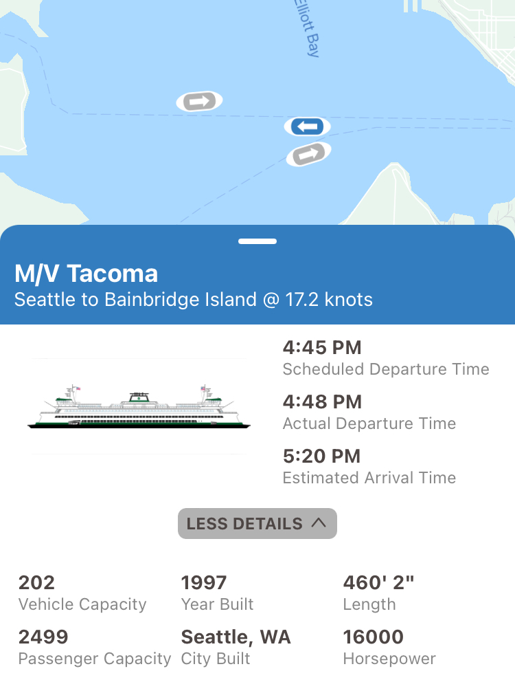
_On the vessel view screen, we added additional vessel details to the vessel modal, with important details like vehicle and passenger capacity._

### Dark Mode

In response to another user request, we spent a good amount of time implementing a theming engine and thinking carefully about how to implement a dark mode well. Users are able to toggle this mode manually, or follow the system settings. I am quite happy with how this turned out.

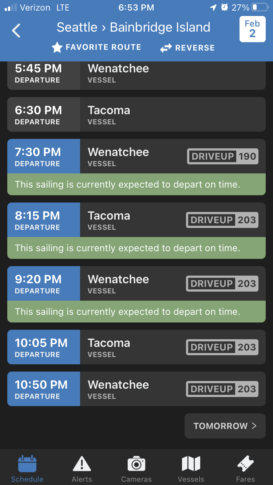
_Easy on the eyes._

## Favorites

Favorite routes are a key feature for regular ferry users, and we wanted to find a way to show schedule prediction info for favorite routes directly on the home screen. Using the colors from route predictions to indicate severity of delay, we added badges to the existing favorite route component for a simple but effective solution.

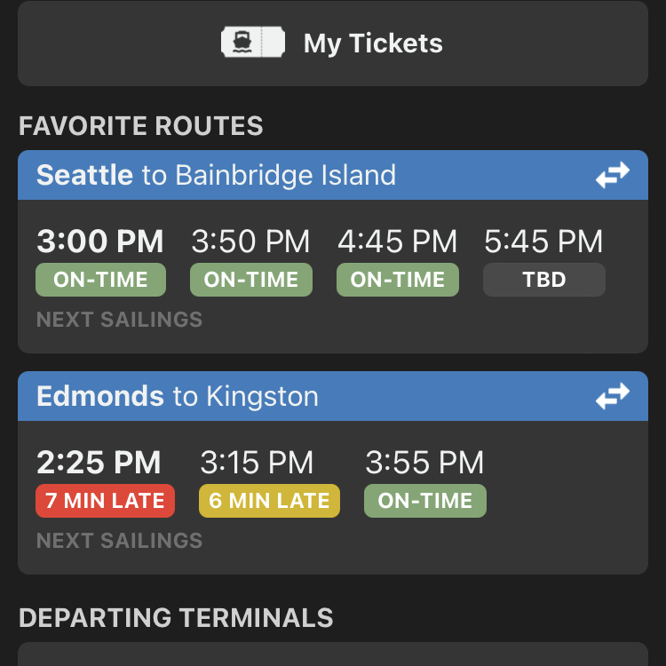
_Red-Yellow-Green provides quick visual confirmation of sailing delay status._

## Tickets

Next up was a major redesign of the saved ticket display. This feature allows regular ferry riders to scan a Washington State Ferry ticket with the app, which then checks the WSF ticket API for remaining uses and expiry dates. The user can then show a representation of the physical ticket barcode at the ticketing booth, negating the need to carry a physical copy of every ticket they may own.

**Before:**

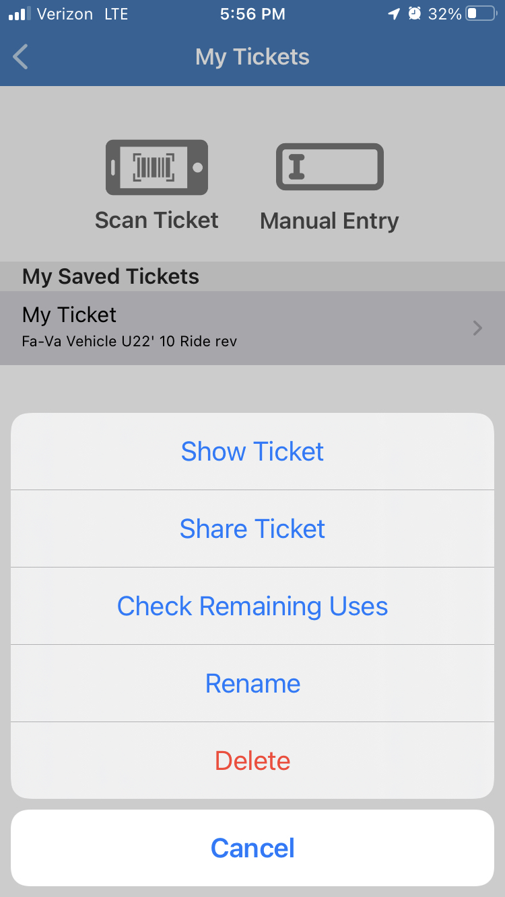
_The FerryFriend 3.0 ticket screen. Although functional, there was lots of room for improvement here._

**After:**

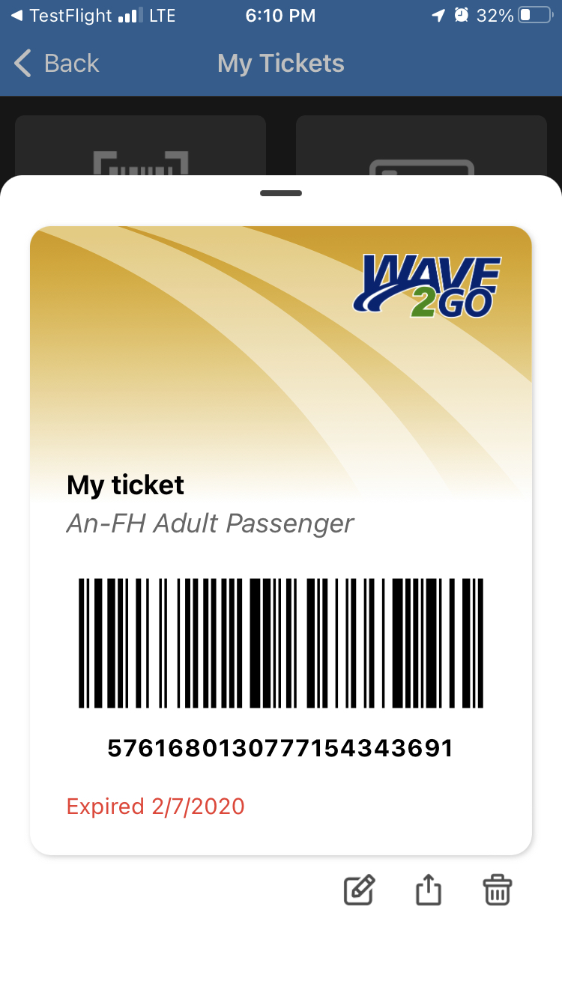
_The new ticket screen shows all relevant information in one place, and emulates the look of a physical WSF ticket._

This stored digital ticket offers an opportunity to easily share tickets between users. With an implementation on Ferryfriend.com, we were able to use link query string parameters to render a web-based visualization of the same ticket, allowing anyone to utilize a shared FerryFriend ticket, even if they don't have the app installed on their phone. [See for yourself here](https://www.ferryfriend.com/share_ticket/?barcode=5761680130777154343691&type=An-FH%20Adult%20Passenger&expiryDate=February%207%2C%202020&remainingUses=0&lastLookup=2022-02-03T02%3A10%3A31.435Z&plu=761531221AWOPT&description=An-FH%20Adult%20Passenger&price=%2414.00&status=Invalid&itemName=Adult%20Psgr%20%28T%29&name=My%20ticket%20).

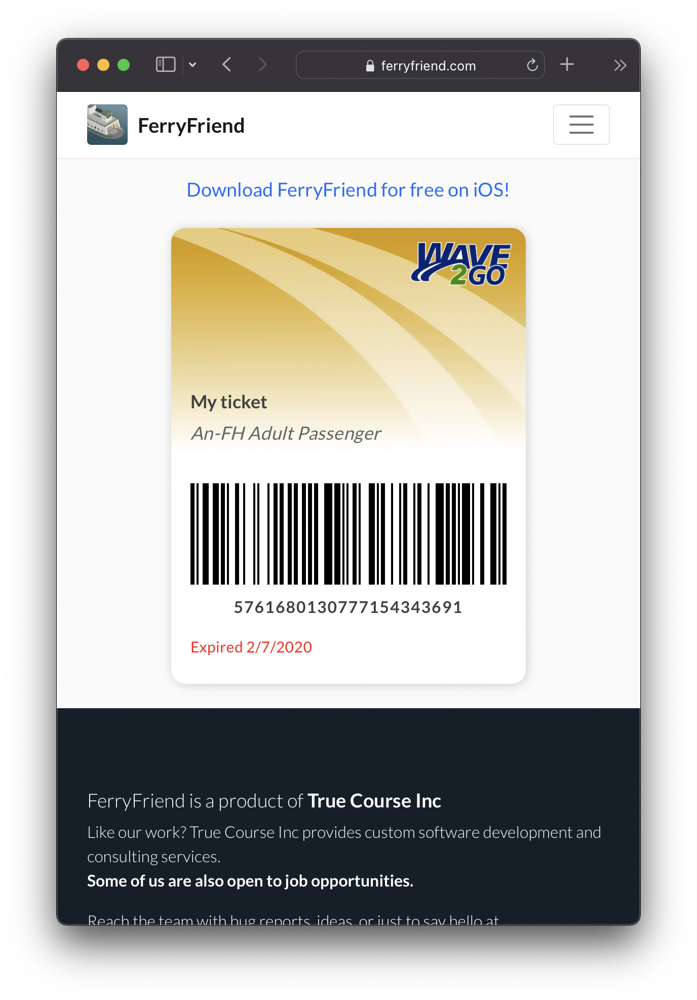
_A web-based display of tickets allows ticket sharing to users who do not have the app installed._

## Testing

As of this writing, FerryFriend 4.0 for Android is in public beta ([see it on the Play Store](https://play.google.com/store/apps/details?id=com.truecourse.FerryFriend)). An iOS beta is coming soon! In the meantime, [check out the FerryFriend website](https://www.ferryfriend.com/).

This was a project of "firsts" for me: my first time working on a full-scale application, and my first project with a "real" user base. I am hugely grateful for the team at FerryFriend and the many hours of mentorship they provided over the course of this project, as well as their encouragement to take on new features and domains outside of my comfort zone. I am proud of what I helped make, and am looking forward to seeing what happens with the app in the future!
