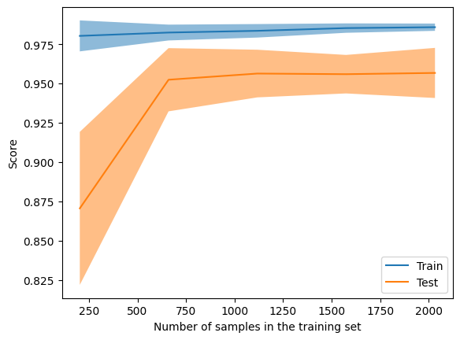
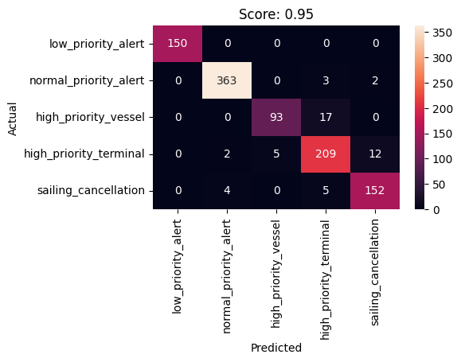

One of the main issues we encountered while improving FerryFriend's alert service was how to handle the sometimes overwhelming pace of alerts coming from the WSF system. Often, important time-sensitive schedule alerts (i.e. _"This sailing is cancelled"_) will be mixed in with numerous, lower priority alerts. The perennial example we see is _"the ADA Elevator is out of service on this vessel."_ Potentially important to some users! But probably not the same level of urgency as a cancelled sailing.

As we worked to surface official alerts higher in the app ui, we realized we would need some way to filter these incoming alerts by some priority metric so we could differentiate which kinds of alerts we want to push to users. (The [WSF Traveller API ↗](https://www.wsdot.wa.gov/ferries/api/schedule/documentation/rest.html) does provide an `AlertTypeID` and some flag fields, but in our experience these are... less than reliable.)

## Step 1: Collect Some Training Data

Since we weren't able to download historical alerts, was to start collecting a training set of alerts. I set up a Postgres database with a `jsonb` field to capture the entire alert object, then used a simple cron job to collect new alerts from WSF and add them to our collection.

Next we had to annotate the data. Based on some discussions with various users, we narrowed our categories down to 5 main types of alerts:

<ol className="mt-4 ml-4 list-outside list-decimal">
  <li>
    <p className="mt-8 font-extrabold">**Low Priority**</p>
    <p className="ml-1 text-sm">
      The lowest priority alerts. Elevators, general policy announcements, out
      of hotdogs in the galley, etc.
    </p>
  </li>
  <li>
    <p className="mt-8 font-extrabold">**Normal Priority**</p>
    <p className="ml-1 text-sm">
      Most general service alerts fall into this category. May be time specific,
      but not urgent.
    </p>
  </li>
  <li>
    <p className="mt-8 font-extrabold">**Vessel Alerts**</p>
    <p className="ml-1 text-sm">
      High priority alerts specific to a given vessel (or vessels).
    </p>
  </li>
  <li>
    <p className="mt-8 font-extrabold">**Terminal Alerts**</p>
    <p className="ml-1 text-sm">
      Terminal-specific high priority alerts. Examples include Terminal delay
      statuses (but not return to normal schedule alerts)
    </p>
  </li>
  <li>
    <p className="mt-8 font-extrabold">**Sailing Cancellations**</p>
    <p className="ml-1 text-sm">
      Cancelled sailings, altered schedules, lack of documented crew. These are
      inherently the highest priority of alerts.
    </p>
  </li>
</ol>

In order to facilitate labelling the couple of thousand alerts we guesstimated would be needed to train up a model, I decided to take the opportunity to build a little webapp to help me label things quickly. Admittedly I maybe went a little overboard with this part of the project, but it was a great chance to play with setting up a PWA and honestly, being able to pull out my phone and quickly categorize 20 or 30 alerts every day or two made the entire labelling process much more painless.



## Step 2: Build a Classifier Model

After collecting and annotating a few thousand alerts, I decided to dig into building a classifier. Based on a fair amount of reading through the Scikit-learn docs (and a fairer amount of trial and error), I settled on a Support Vector Machine as the likeliest candidate for building an effective model. The full Jupyter notebook can be seen [here](/alerts/notebook), but here are the results:

```
                          precision    recall  f1-score   support

    low_priority_alert       1.00      1.00      1.00       150
 normal_priority_alert       0.98      0.99      0.99       368
  high_priority_vessel       0.95      0.85      0.89       110
high_priority_terminal       0.89      0.92      0.90       228
  sailing_cancellation       0.92      0.94      0.93       161

              accuracy                           0.95      1017
             macro avg       0.95      0.94      0.94      1017
          weighted avg       0.95      0.95      0.95      1017
```



Its not perfect, but for a first stab at machine learning, an f-beta score of 0.95 felt like an accomplishment. Now it was time to make the model usable.

## Step 3: Integrate the Model

Now that I'd built my model, I was able to build a pipeline to couple the `vectorizer` preprocessing with the classifier model, and export that to a .joblib file. With that in hand, I deployed a simple fastAPI server with a `/predict` endpoint where I could send **raw** WSF alert json objects, and receive confidence weights for each alert category.

```python
@app.post('/predict')
async def predict(alert_request: AlertRequest):
    # Create DataFrame from the alert
    df = pd.DataFrame.from_dict(alert_request, orient='columns')
    tokens = [' '.join(str(df[1].values[0]).lower().translate(
        str.maketrans('', '', string.punctuation)).split())]

    # Predict the alert
    prediction = model.predict_proba(tokens)
    predicted_category = categories[prediction.argmax()]

    # Build dict with probabilities and category names
    prediction = dict(zip(categories, prediction[0]))

    # Return the prediction
    return {'prediction': predicted_category, 'probability': prediction}
```

With this API in place, the regular FerryFriend alerts service can determine categories for incoming alerts, which can then be filtered and prioritized appropritately within the application.
