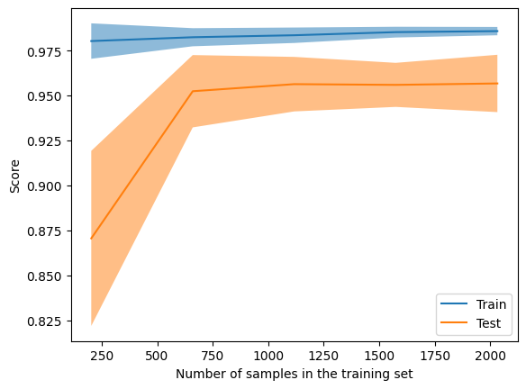
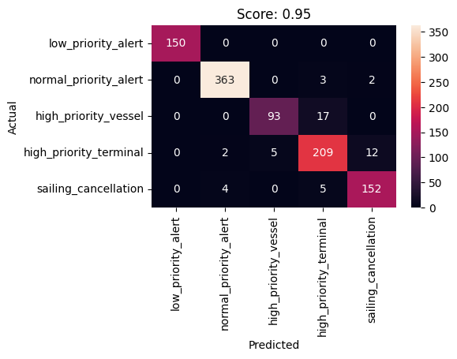

> This is a notebook I wrote while working on a project to classify WSF ferry alerts using scikit-learn. The output of each cell is rendered below the cell as it is in the notebook. [See the project writeup here](/alerts).

_Uses Scikit-learn to train a Support Vector Machine (SVM) to classify WSF alerts._

## Preprocess data

#### Load data and categories

```python
%matplotlib inline
import pandas as pd


rawData = pd.read_csv('db-dump.csv')

# Drop predictions column
data = rawData.drop('prediction', axis=1)
data = data.dropna()

# drop rows with audit_count == 0
data = data[data.audit_count != 0]
data.head()

```

    Matplotlib is building the font cache; this may take a moment.

<div>
<style scoped>
    .dataframe tbody tr th:only-of-type {
        vertical-align: middle;
    }

    .dataframe tbody tr th {
        vertical-align: top;
    }

    .dataframe thead th {
        text-align: right;
    }

</style>
<table border="1" class="dataframe">
  <thead>
    <tr style="text-align: right;">
      <th></th>
      <th>bulletinid</th>
      <th>alert</th>
      <th>alert_category</th>
      <th>audit_count</th>
    </tr>
  </thead>
  <tbody>
    <tr>
      <th>0</th>
      <td>80227</td>
      <td>{\n  "IVRText": null,\n  "SortSeq": 2,\n  "Ale...</td>
      <td>high_priority_vessel</td>
      <td>2</td>
    </tr>
    <tr>
      <th>1</th>
      <td>80228</td>
      <td>{"IVRText": null, "SortSeq": 2, "AlertType": "...</td>
      <td>high_priority_vessel</td>
      <td>2</td>
    </tr>
    <tr>
      <th>2</th>
      <td>80223</td>
      <td>{\n  "IVRText": null,\n  "SortSeq": 2,\n  "Ale...</td>
      <td>sailing_cancellation</td>
      <td>2</td>
    </tr>
    <tr>
      <th>3</th>
      <td>80333</td>
      <td>{"IVRText": null, "SortSeq": 3, "AlertType": "...</td>
      <td>low_priority_alert</td>
      <td>2</td>
    </tr>
    <tr>
      <th>4</th>
      <td>80072</td>
      <td>{"IVRText": null, "SortSeq": 2, "AlertType": "...</td>
      <td>high_priority_vessel</td>
      <td>2</td>
    </tr>
  </tbody>
</table>
</div>

#### Extract the categories from the Dataframe

```python

categories = [
 'low_priority_alert',
 'normal_priority_alert',
 'high_priority_vessel',
 'high_priority_terminal',
 'sailing_cancellation'
 ]

categories
```

    ['low_priority_alert',
     'normal_priority_alert',
     'high_priority_vessel',
     'high_priority_terminal',
     'sailing_cancellation']

#### Convert alert text to numerical features

```python
import string
from nltk.tokenize import word_tokenize
from nltk.corpus import stopwords
from nltk.stem import PorterStemmer
from sklearn.feature_extraction.text import TfidfVectorizer


# strip and tokenize
data['alert'] = data['alert'].apply(lambda x: x.lower())
data['alert'] = data['alert'].apply(lambda x: x.translate(str.maketrans('', '', string.punctuation)))
data['alert'] = data['alert'].apply(lambda x: word_tokenize(x))

# Remove stop words and stem the words
stop_words = set(stopwords.words('english'))
data['alert'] = data['alert'].apply(lambda x: [word for word in x if word not in stop_words])

stemmer = PorterStemmer()
data['alert'] = data['alert'].apply(lambda x: [stemmer.stem(word) for word in x])

# Convert the preprocessed alert data to numerical vectors
vectorizer = TfidfVectorizer()
X = vectorizer.fit_transform(data['alert'].apply(lambda x: ' '.join(x)))
y = data['alert_category']
z = data['bulletinid']

data['alert'].head()

```

    0    [ivrtext, null, sortseq, 2, alerttyp, alert, b...
    1    [ivrtext, null, sortseq, 2, alerttyp, alert, b...
    2    [ivrtext, null, sortseq, 2, alerttyp, alert, b...
    3    [ivrtext, null, sortseq, 3, alerttyp, alert, b...
    4    [ivrtext, null, sortseq, 2, alerttyp, alert, b...
    Name: alert, dtype: object

#### Split data into training and test sets

```python
from sklearn.model_selection import train_test_split


X_train, X_test, y_train_labels, y_test_labels, id_train, id_test = train_test_split(X, y, z, test_size=0.4, random_state=42)

print('Train:', len(X_train.toarray()), '\n Test:', len(X_test.toarray()))
# print the first row of the training data
print(X_train.shape)
```

    Train: 1524
     Test: 1017
    (1524, 9157)

#### Encode labels

```python
from sklearn.preprocessing import LabelEncoder


le = LabelEncoder()
le.fit(categories)
y_train = le.transform(y_train_labels)
y_test = le.transform(y_test_labels)
le.classes_

```

    array(['high_priority_terminal', 'high_priority_vessel',
           'low_priority_alert', 'normal_priority_alert',
           'sailing_cancellation'], dtype='<U22')

## Train and score SVM

```python
from sklearn.svm import SVC


clf = SVC(kernel="linear", probability=True)
clf.fit(X_train, y_train)
y_pred = clf.predict(X_test)
score = clf.score(X_test, y_test)
score
```

    0.9508357915437562

#### Learning curve

```python
from sklearn.model_selection import LearningCurveDisplay


LearningCurveDisplay.from_estimator(clf, X, y, cv=5)
```

    <sklearn.model_selection._plot.LearningCurveDisplay at 0x30455a660>



#### Cross Validation

```python
from sklearn.model_selection import cross_val_score
scores = cross_val_score(clf, X, y, cv=5)

print("%0.2f accuracy with a standard deviation of %0.2f" % (scores.mean(), scores.std()))
```

    0.96 accuracy with a standard deviation of 0.02

#### Confusion matrix

```python
from matplotlib import pyplot as plt
from sklearn.metrics import confusion_matrix
import seaborn as sns


cm = confusion_matrix(y_test, y_pred)
plt.figure(figsize=(5,3))
sns.heatmap(cm, annot=True, yticklabels=categories, xticklabels=categories, fmt='d')
plt.ylabel('Actual')
plt.xlabel('Predicted')
plt.title('Score: ' + str(round(score, 2)))

```

    Text(0.5, 1.0, 'Score: 0.95')



#### Classification report

```python
from sklearn.metrics import classification_report


print(classification_report(y_test, y_pred, target_names=categories))
```

                            precision    recall  f1-score   support

        low_priority_alert       1.00      1.00      1.00       150
     normal_priority_alert       0.98      0.99      0.99       368
      high_priority_vessel       0.95      0.85      0.89       110
    high_priority_terminal       0.89      0.92      0.90       228
      sailing_cancellation       0.92      0.94      0.93       161

                  accuracy                           0.95      1017
                 macro avg       0.95      0.94      0.94      1017
              weighted avg       0.95      0.95      0.95      1017

- The **precision** is the ratio `tp / (tp + fp)` where `tp` is the number of true positives and `fp` the number of false positives. The precision is intuitively the ability of the classifier not to label a negative sample as positive.

- The **recall** is the ratio `tp / (tp + fn)` where `tp` is the number of true positives and `fn` the number of false negatives. The recall is intuitively the ability of the classifier to find all the positive samples.

- The **F-beta score** can be interpreted as a weighted harmonic mean of the precision and recall, where an F-beta score reaches its best value at 1 and worst score at 0.

- The **support** is the number of occurrences of each class in `y_true`.

#### Principle Component Analysis

Reduce the dimensionality of the data and plot the results.
This is mostly for fun (?)

```python
from sklearn.decomposition import PCA


pca = PCA(n_components=2)
X_train_pca = pca.fit_transform(X_train.toarray())
plt.figure(figsize=(7, 5))
plt.title('PCA of the training data')
sns.scatterplot(x=X_train_pca[:, 0], y=X_train_pca[:, 1], hue=y_train_labels, palette=sns.color_palette('husl', len(categories)))
plt.show()
```


### Analyze the misclassified alerts

#### Plot misclassified alerts with predictions and annotations

```python
# plot the correlation between probability and actual category
y_pred_prob = clf.predict_proba(X_test)
y_pred_prob = pd.DataFrame(y_pred_prob)

# Predicted category is the highest probability of the 5 categories
y_pred_prob['predicted'] = le.classes_[y_pred_prob.idxmax(axis=1)]

y_pred_prob['actual'] = y_test_labels.tolist()
y_pred_prob['bulletinid'] = id_test.tolist()

# add the alert for a given bulletinid
y_pred_prob = y_pred_prob.merge(rawData[['bulletinid', 'alert']], on='bulletinid', how='left')

# filter for misclassified alerts
y_pred_prob = y_pred_prob[y_pred_prob['actual'] != y_pred_prob['predicted']]

# set column labels for categories
y_pred_prob.columns = [le.classes_.tolist() + ['predicted', 'actual', 'bulletinid', 'alert']]

# y_pred_prob.to_csv('misclassified.csv', index=False)
# len(y_pred_prob)
# show just bulletinid and alert
y_pred_prob.to_csv('misclassified.csv', index=False)
```

### Export model for use in the API

```python
from joblib import dump
from sklearn.pipeline import Pipeline


# Build a pipeline to preprocess input data and predict the category
tfidf_svm = Pipeline([('tfidf', vectorizer), ('svm', clf)])
dump(tfidf_svm, 'out/model.joblib')
```

    ['out/model.joblib']
