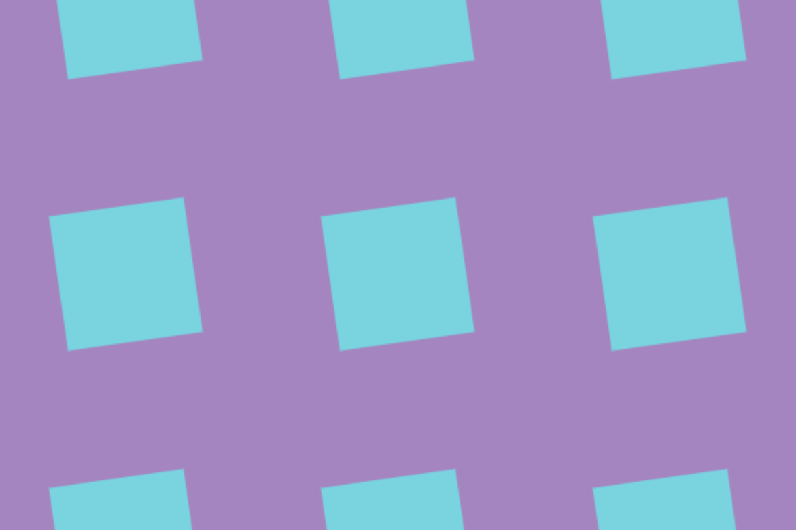
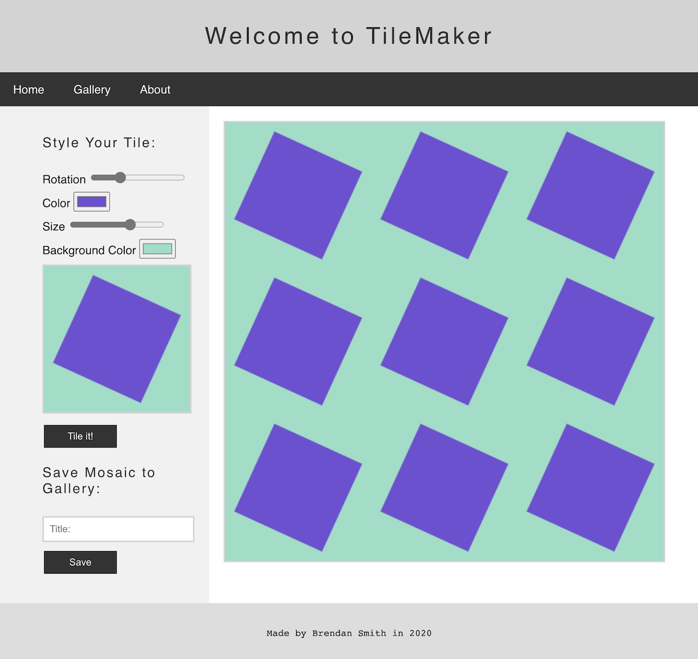
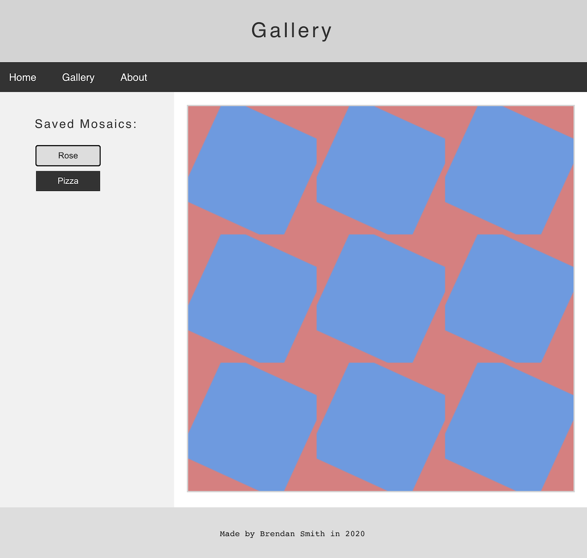

TileMaker is the first thing functioning web application I ever
built. A last minute application to a coding bootcamp, I
constructed this app from start to finish in two days, over
christmas, while visiting my parents.

Built using basic HTML, CSS, and (poorly understood) Javascipt,
along with extensive googling, it allows for users to design a
tile (rectangle) with varying rotation, color, size, and
background colors. The resultant tile is then repeated 3x3 on a
canvas element, with an option to save individual
'mosaics' using the browser's localStorage. This
simple recipe gives rise to lots of interesting designs.

Later, I deployed the site to GitHub Pages, where it [lives to this day](https://brendanrsmith.github.io/tilemaker/).

I really enjoy looking back on this project, and marveling at
how far I've come on my journey as a developer in such a
relatively short period of time. This project felt expansive in
its possibility at the time, and was a definitey cayalyst for my
getting more serious about pursiing software developement.

Plus, it's still fun to try and design the _perfect_ tile.
